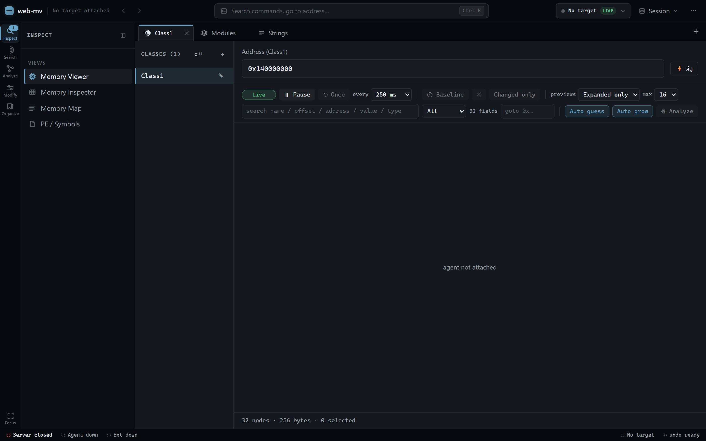
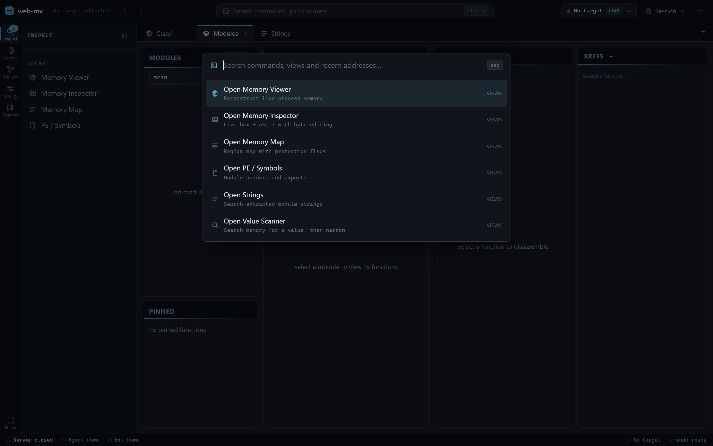
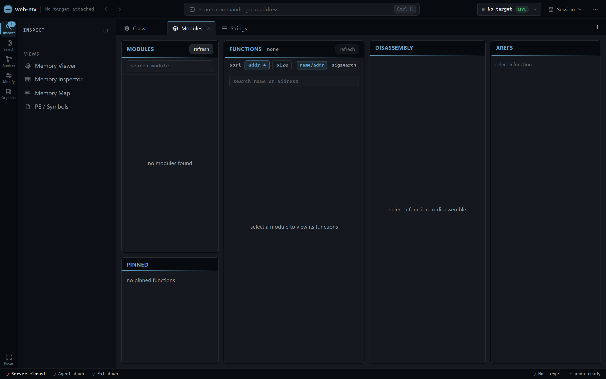

# web-mv 🔍

A web-based memory viewer and dynamic analysis tool designed for game reverse engineering, class struct layout reconstruction, string enumeration, value scanning, and AI-assisted analysis.

Powered by a lightweight Bun relay server and a SolidJS frontend, `web-mv` connects directly to target processes running the **Angel/Echo** agent runtime.



---

## Signal Workbench Shell

The whole app lives in one workspace shell:

* **App bar** with the workspace/target indicator, back/forward navigation, and a session menu.
* **Command palette** (`Ctrl/Cmd + K`) — fuzzy-search every view and action, or type an address to jump straight to it.
* **Activity rail** grouping the views into **Inspect / Search / Analyze / Modify / Organize**, with a contextual sidebar per group and a **Focus mode** that hides the chrome.
* **Tabbed workspace** — open several views side by side, split the active tab, and reopen the last session.
* **Status bar** showing the relay, core agent, and ext-agent connection state plus the active target.
* **Theming** — a unified steel-blue accent token system with light/dark and custom-accent options, applied consistently across every view.



---

## Features

### 🧠 Dynamic Memory Viewer (ReClass-Style)
* **Interactive Class Reconstruction**: Define struct layouts, retype memory fields, and inspect live byte snapshots. Fields auto-grow and support inline pointer expansion, multi-selection, repeat-as-array, per-field value sparklines, and byte/value change highlighting.
* **Rich Field Types**: integers and bitfields (with **named bits**), floats/doubles, `vec2`/`vec3`/`vec4`, a 4x4 **matrix**, data + **function pointers**, ASCII/UTF-16 strings with a **user-configurable length**, `union` views (one slot decoded as int/float/hex at once), and **references to named structs/enums** from the Data Types registry — nested struct fields render inline as collapsible rows. Per-field **display format** (auto/dec/hex/bin) and **endianness** (little/big, where safe) via the right-click menu.
* **Live Inspection Controls**: pause/resume polling (pausing freezes the snapshot and stops region *and* pointer-preview reads), **Refresh once** while paused, a 100/250/500/1000 ms interval selector, and a Live/Paused/Reading/Error status badge. The interval and pause preference persist; snapshot bytes never do.
* **Baseline Compare**: capture the current region as a baseline, then every field that differs from it is marked (separately from the per-tick change highlight). A **Changed only** toggle shows just those fields; changing the class, base address, or layout size invalidates the baseline automatically.
* **Inline Typed Editing**: double-click a value (or press Enter) to edit it in place — decimal/hex/binary integers with width+sign bounds checking, floats, bools, pointers, strings (capacity-checked, NUL-padded), bitfields, vectors, matrices, and enum members **by name**. Writes are validated before sending, show pending/error states, and the region is re-read after a successful write — the grid never fakes bytes locally. Process writes are not part of layout undo.
* **Search, Filters & Go-To**: search across field name, offset, absolute address, displayed value, and type; filter All / Changed / Pointers / Unnamed / Numeric; "goto 0x…" jumps the virtualized list to an offset. Filtered rows keep their original indices, so rename/retype/delete/insert/repeat always hit the right node.
* **Controlled Auto-Analysis**: separate **Auto guess** / **Auto grow** toggles (persisted per target) plus a one-shot **Analyze** button. Every guess carries a confidence tier and a reason; automatic mode applies only **high-confidence** results (follow-check-verified pointers, NUL-terminated strings) while medium/low guesses appear as reviewable per-row suggestions with accept one / accept selected / accept all / reject. Fields can be **locked** (🔒) against all automatic changes; auto-grow stops at 0x1000 bytes and while paused or detached. Stale suggestions are re-verified against the current snapshot before applying.
* **Pointer-Preview Budgeting**: preview modes **Expanded only** (default) / **Visible** / **All**, a configurable max previews per cycle, expanded > selected > visible prioritization, per-target read deduplication, and a "N throttled" indicator when the budget is exceeded. RTTI stays cached per attachment and clears on target switch.
* **Keyboard-First Grid**: ↑/↓ move, Shift+↑/↓ and Shift+click extend ranges, Home/End/PageUp/PageDown navigate, Ctrl/Cmd+A selects all filtered rows, Enter edits the value, F2 renames, Delete removes (undo-able), Menu key / Shift+F10 opens the field menu, Escape closes editors/menus/suggestions. Shortcuts never fire while typing in an input or modal.
* **Undo / Redo** across every structural edit (rename, retype, insert/delete, add/remove class), with persisted class definitions namespaced per attached target.
* **C++ Header Exporter**: Generate ready-to-compile C++ struct definitions complete with offset-calculated padding (`uint8_t pad_0x4[0x8]`), vectors/matrices as float arrays, unions, enum/struct references, named-bit comments, and size assertions.

### 🧬 Data Types Registry
* **User-Defined Structs & Enums**: author reusable **structs** (ordered typed fields) and **enums** (named integer constants) once and reference them by name from any Memory Class field.
* **Nested Composition**: struct fields can themselves reference other structs/enums; sizes are resolved recursively (cycles are guarded).
* **Enum Seeding**: seed enum members from a set of observed integer values, and render integers as their member names.
* **Portable**: the whole registry round-trips through JSON export/import, and imported references that don't resolve render as a flagged "missing" state instead of crashing.

### 🧵 IDA-Style Strings View
* **Full-Module String Extraction**: Reads a module's virtual memory in chunks and extracts printable ASCII and UTF-16LE strings.
* **Smart Category Filters**: Quick-filter by **URLs**, **File Paths**, **Console Commands**, or **RTTI / Class Names**.
* **Regex Filtering & Exports**: Search with Regular Expressions and export string tables to **CSV**, **JSON**, or **TXT**.
* **Jump to Memory**: Click any string address to immediately open and target a Memory Class at that location.

### 🎯 Value Scanner (Cheat-Engine-Style)
* **First Scan / Next Scan**: sweep a module for an exact value, then narrow the survivors with each subsequent scan.
* **Comparison Operators**: `unchanged` / `changed` / `increased` / `decreased`, or a fresh `= / > / <` value comparison against the candidate set.
* **Server-Held Candidates**: the ext agent holds the full result set (`scan_new` / `scan_filter` / `scan_clear`); the view shows a bounded sample plus the running match count, with a next-scan hotkey.
* **Send-To**: push any hit straight into the Memory Viewer, Cheat Table, or Bookmarks.

### 🗺️ Memory Map (Regions)
* **Live Region Map**: walks the process's committed regions via the ext agent's `regions` verb (`virtual_query`) — real base/size and r/w/x protection flags, unlike the static PE section table.
* **Scan Scoping & Triage**: the basis for scoping scans and for spotting heaps/stacks; executable rows jump into the disassembler, data rows into a Memory Class.

### 🔗 Pointer Chain Resolver
* **Bounded Chain Walking**: given a base (address or `module+offset`) and a list of offsets, walks `addr = *addr + offset` per level and shows every hop plus the final address and its live value.
* **Auto-Resolve**: re-walks on a cadence so the final address/value stay live as the game moves them — chain following (a handful of 8-byte reads), never scanning.

### ⚡ Static View & Signature Tools
* **Function Disassembler**: Enumerate and disassemble process functions with syntax highlighting and opcode inspection.
* **IDA-Style SigMaker**: Generate minimal unique pattern scan signatures for **any address** — disassembled **code** or **raw data bytes** — not just functions, with automatic RIP-relative (`disp32`) and call/jump (`rel32`) wildcarding. Launch it from the command palette (type any address), the disassembly/function panels, or the memory view's `⚡ sig` button; a **Code / Raw bytes** toggle disassembles on the fly or reads bytes verbatim.
* **Auto-Find Unique Signature**: Iteratively expands instruction depth to find the shortest 100% unique signature (1 hit in module) in live process memory.
* **Interactive Byte Editor**: Visual byte breakdown with clickable pills to toggle wildcard masks per byte manually.
* **Multi-Format Exporters**: One-click copy for **IDA Pattern** (`48 8B 05 ?? ??`), **C++ String & Mask**, **C++ Byte Array**, **C++ 0x?? Array**, and **Python**.
* **Function Sigsearch**: Map signature scan hits directly to containing functions, displaying function names, RVAs, hit offsets (`+0x18`), and prologue (`+0x0`) badges.
* **IDA Signature Scanner**: Search for byte patterns with wildcards, filter by function prologues or mapped code, and resolve RIP-relative instructions (`mov rax, [rip+disp]`).
* **Direct Function Jump**: Jump straight from signature scan results into function disassembly with a single click (`view function`).

### 📊 Static Analysis Workbench
* **Call Graph** and **Control-Flow Graph** panels over the current function selection.
* **Operand / Immediate Search** across a module's instructions.
* **Module Function Stats** — size distribution and counts for the selected module. All four panels are driven by the selection made in the Modules tab.

### 🤖 Multi-Agent RPC Multiplexing (`POST /rpc`)
* **AI Agent Integration**: Exposes a stateless HTTP `POST /rpc` endpoint allowing external AI coding agents (such as VSCode extensions or LLM agents) to query and modify memory concurrently without interrupting the browser UI session.

### 📌 Cheat Table & Memory Writing (`/agent-ext`)
* **Cheat Table View**: A persisted watch list of addresses. Each row shows a live-decoded value (`u8`–`u64`, `i8`–`i64`, `f32`, `f64`), lets you push an edited value back to the process, and can be **frozen** — re-written to a captured value every poll tick (Cheat Engine style).
* **Memory Writing**: `write` verb (`process::write_bytes`) for patching values and bytes.
* **Module Dumping**: `dump` verb wrapping `process::dump` for on-disk image dumps, with optional **IAT rebuild** (`iat_rebuild`).
* **Import / Export Tables**: `exports` and `imports` verbs walk a module's PE export/import directories (IMAGE_DIRECTORY_ENTRY_EXPORT/IMPORT) and return named symbols with addresses / IAT slots.
* **PE / Symbols View**: pick any module and dump it, or walk its **section headers** (`sections` verb — name, RVA, virtual/raw size, r/w/x protection), **PE header / data directories** (`pe_header` / `pe_dirs`), **resource tree** (`resource_tree`), **exports**, and **imports** in on-demand tables.
* **Memory Inspector**: a live hex + ASCII dump of any region with click-to-edit bytes (read on a poll, single-byte write).
* **Snapshot Diff View**: capture a memory region as a baseline, then re-read and list exactly which bytes changed — a region-scoped stand-in for a value scanner.

### 🗂️ Organize & Navigation
* **Bookmarks View**: a persisted list of pinned addresses with labels/notes; each jumps straight to the Memory Viewer or the disassembler.
* **Session History**: a running log of the addresses and classes you've visited, so you can jump back.
* **Address Labels**: a shared resolver renders any absolute address as `module+0xRVA` everywhere.
* **Send-To actions**: push an address into the Value Scanner, Cheat Table, or Bookmarks straight from the strings, PE, regions, and snapshot-diff views (shared stores back them all).
* **Session Save / Load**: export the whole workspace (classes, data types, cheat table, bookmarks) to JSON and reload it.

### 🔗 Workflow glue
* **Ext-agent status badge**: the status bar shows `ext: up/down` so the write-family features aren't a silent no-op when `web_mv_ext_agent.as` isn't loaded.
* **Write safety**: writes surface failures, **undo last write** restores the prior bytes, and an **echo-verify** re-reads to warn when the game immediately overwrites your value.
* **JSON export/import**: cheat tables and bookmarks are portable via one-click download / file import.

These write-family verbs are served by a **separate extension agent** (`web_mv_ext_agent.as`) over a second relay endpoint (`/agent-ext`); the relay routes each request by verb, so the browser talks to one server. See setup step 2 below.

> **Architecture note.** Echo's built-in memory server (`process::open_socket`) serves the read/scan/disassemble verbs and cannot be extended from this repo, and only one such socket can bind the relay's `/agent` endpoint at a time. The mutation verbs therefore live in a companion AngelScript agent that attaches to the same process and speaks a custom `ws::connect` handler on `/agent-ext`. Run both scripts together.



---

## Quick Start

### 1. Build & Launch Server
Make sure [Bun](https://bun.sh) is installed on your machine.

```bash
# Build frontend static bundle and compile relay into release/
build-release.bat

# Launch the relay server (defaults to http://127.0.0.1:9000)
run.bat
```

Open **`http://127.0.0.1:9000`** in your browser.

---

### 2. Connect Target Process (Angel Agent)

Load `example_agent_script.as` in **Echo/Angel** after launching your target game process:

```angelscript
// example_agent_script.as
const string PROCESS_NAME = "HuntGame.exe";
const string GAME_MODULE  = "GameHunt.dll";
const string RELAY_URL    = "ws://localhost:9000/agent";

void main() {
    process::attach(PROCESS_NAME, true);
    process::open_socket(RELAY_URL);
}
```

Once connected, the status bar will update to **`agent: up`**.

**For the Cheat Table / scanner / write features**, also load `web_mv_ext_agent.as` in Echo/Angel (set its `PROCESS_NAME` to match). It attaches to the same process and connects to the relay's `/agent-ext` endpoint, adding the `write` / `dump` / `exports` / `imports` / `regions` / `scan_*` verbs. The read/scan-by-signature tools work with only the core script; loading the ext script is what enables writing, freezing, and value scanning.

---

## AI Agent / RPC API

External tools and AI agents can query the attached process via HTTP `POST /rpc`.

### Example Request (Read Memory)
```bash
curl -X POST http://127.0.0.1:9000/rpc \
  -H "Content-Type: application/json" \
  -H "x-mv-client: vscode-agent" \
  -d '{
    "type": "read",
    "address": "0x7ff6abcd1234",
    "size": 64
  }'
```

### Supported RPC Commands

**Core agent (`/agent`)**
* `ping` — Check agent attachment status and process base address
* `read` / `read_batch` — Read raw memory bytes
* `modules` — Enumerate loaded modules (`name`, `base`, `size`)
* `sig_scan` / `sig_scan_ida` — Perform IDA pattern scans
* `string_scan` — Extract strings from a module
* `rtti_resolve` / `rtti_resolve_batch` — Resolve RTTI class names
* `enumerate_functions` — List module functions
* `disassemble` — Disassemble code at a target address
* `resolve_relative` — Resolve a RIP-relative reference to its target

**Extension agent (`/agent-ext`)**
* `write` — Write bytes/values to memory
* `scan_new` / `scan_filter` / `scan_clear` — Value scanner (first/next/reset)
* `raw_scan` — Raw byte-pattern scan
* `regions` — Walk committed memory regions with protection flags
* `dump` / `iat_rebuild` — Dump a module image, optionally rebuilding the IAT
* `exports` / `imports` — Walk PE export/import directories
* `sections` / `pe_header` / `pe_dirs` / `resource_tree` — PE structure inspection
* `scan_grouped` — Grouped scan results
* `ui_list` / `ui_get` / `ui_set` — Menu Control: enumerate and toggle the agent's own menu controls (drives the **Menu Control** tab)

---

## Phone / LAN access

The relay serves the whole UI on one port, and the browser reaches the WebSocket via the same host
it loaded from — so opening the relay from your phone needs **no rebuild**, only a wider bind.

1. Start the relay with `HOST=0.0.0.0`:

   ```sh
   # PowerShell
   $env:HOST="0.0.0.0"; <your relay start command>
   # bash
   HOST=0.0.0.0 <your relay start command>
   ```

   (`PORT` is also configurable; it defaults to `9000`.)

2. On the phone — **same Wi-Fi/LAN** — open `http://<your-PC-LAN-IP>:9000` (e.g. `http://192.168.1.20:9000`).
   Find the PC's LAN IP with `ipconfig` (Windows) / `ip addr` (Linux).
3. The overlay agent still connects to `ws://127.0.0.1:9000/agent-ext` — it runs on the same PC as the
   relay, so that address is unchanged. Only the browser side goes over the LAN.

Then open the **Menu Control** tab on the phone to toggle features live.

### Safety

* **No authentication.** The relay is a control channel into a process's memory. Bind beyond
  loopback **only on a trusted network**, and never expose the port to the internet directly. For
  remote access, put it behind a TLS reverse proxy (Caddy/nginx) that adds auth, or a private
  network overlay (Tailscale/WireGuard) — then the browser reaches it over `https`/`wss`.
* **Danger controls still require a live PC-side ARM click.** Controls that write game memory
  (aim, chams, no-recoil, …) refuse `ui_set` until the operator clicks *"Menu Control: ARM danger
  controls"* in the overlay. That gate is intentional and cannot be armed from the phone — the
  phone can freely flip overlay-only visuals, but a person at the PC must arm anything that touches
  the game process.

---

## License

MIT
